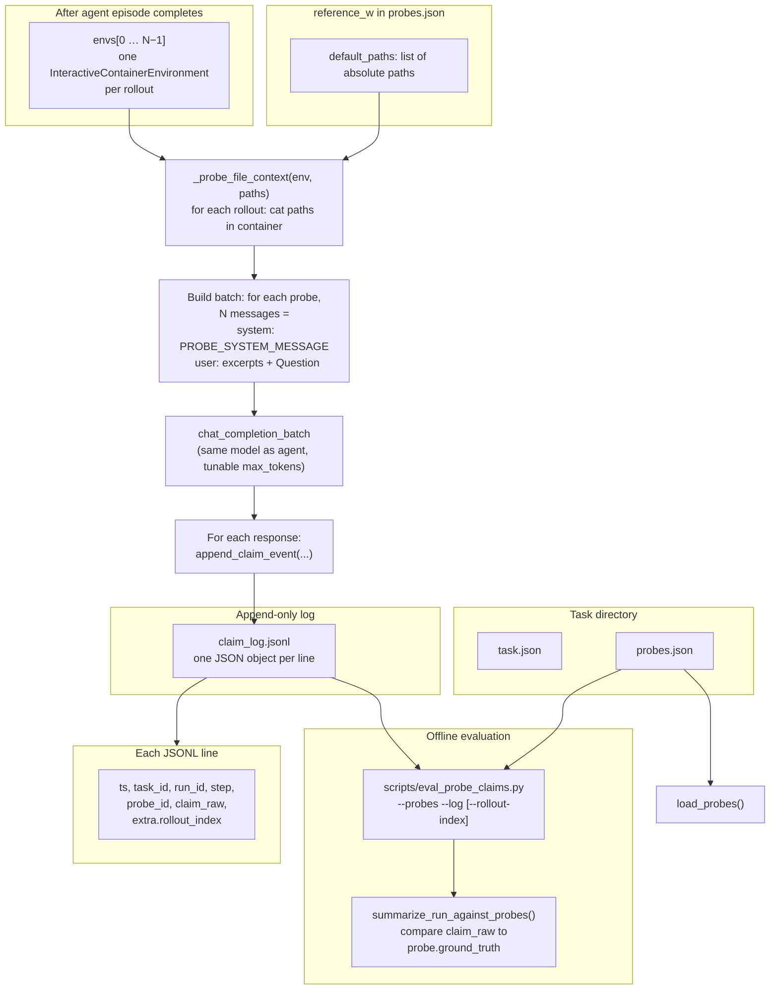
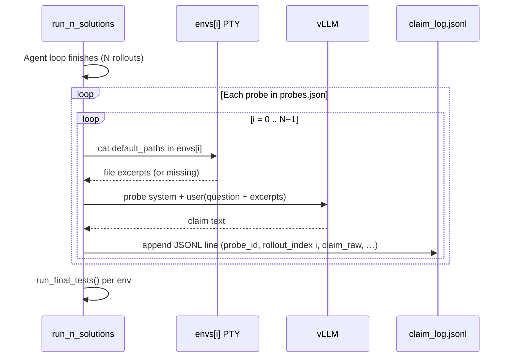

# Probes and `claim_log.jsonl`

How optional **verification probes** integrate with **`generate_solutions.py`** / **`run_n_solutions`**, and how **`scripts/eval_probe_claims.py`** scores them.

## When this runs

Probes run **only if** `probes.json` exists **next to** `task.json` in the task directory. Execution order inside `run_n_solutions`:

1. Interactive agent loop (commands in the Apptainer PTY until done or `max_actions`).
2. **`_run_probes_after_episode`** (this document): for each probe × each rollout, call the **same** vLLM (`chat_completion_batch`) with a short QA prompt; append lines to **`claim_log.jsonl`**.
3. **`run_final_tests`** (`pytest` on `test_final_state.py`) per rollout.

So probe answers reflect **whatever is on disk inside each rollout’s container** at the end of the episode (file excerpts come from `cat` via `env.exec`).

## Flow (Mermaid)



## Simplified sequence



## Ground truth matching

`generator/probe_claims.py` scores each probe with `score_probe_answer()`:

- **`answer_type: "integer"`** — first integer in `claim_raw` vs `ground_truth`.
- **`answer_type: "exact_string"`** — full string vs `ground_truth` (`match.strip_eq` or `casefold_eq`).

If the probe model emits long `<redacted_thinking>` blocks, automated scoring often fails until you strip reasoning or tighten the probe model.

## Commands

```bash
# After a solution run produced claim_log.jsonl
python scripts/eval_probe_claims.py \
  --probes tasks2/task_000000_540a5f77/probes.json \
  --log tasks2/task_000000_540a5f77/claim_log.jsonl \
  --rollout-index 0

python scripts/eval_probe_claims.py ... --json
```
